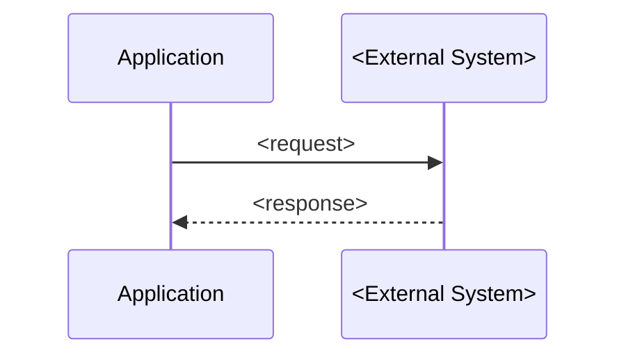
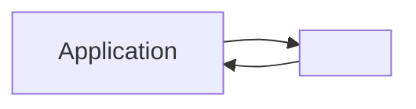

# DOC_GENERATOR Implementation Plan

> **For agentic workers:** REQUIRED SUB-SKILL: Use superpowers:subagent-driven-development (recommended) or superpowers:executing-plans to implement this plan task-by-task. Steps use checkbox (`- [ ]`) syntax for tracking.

**Goal:** Write `skills/project-initiator/DOC_GENERATOR.md` — the V1.3.5 skill that converts discovery.md + mvp-scope.md + arch.md into professional stakeholder-ready documents.

**Architecture:** TDD approach — expected_behaviors fixtures written first, then skill file written to produce those outputs. No automated test runner; testing is manual QA runs in Claude Code, same methodology as ARCH_PROPOSER. Skill file follows the established pattern (Pre-flight → Gate → Conversation → Draft → Save) but adapts it for menu-driven multi-doc generation with a cross-artifact sync check instead of a single-file readiness gate.

**Tech Stack:** Markdown skill files, Mermaid diagram syntax embedded in generated docs, manual test methodology consistent with existing chain skills.

**Spec:** `docs/superpowers/specs/2026-06-04-doc-generator-design.md`

---

## File Map

| Action | Path | Responsibility |
|---|---|---|
| Create | `skills/project-initiator/DOC_GENERATOR.md` | The skill file — full implementation |
| Create | `tests/fixtures/doc-generator/synthetic-01/expected_behaviors.md` | PASS-path test definition (RetailEdge, no DRIFT) |
| Create | `tests/fixtures/doc-generator/synthetic-02-drift/mvp-scope.md` | Modified mvp-scope.md with DRIFT (backend tech mismatch) |
| Create | `tests/fixtures/doc-generator/synthetic-02-drift/expected_behaviors.md` | DRIFT-path test definition |
| Create | `tests/fixtures/doc-generator/TEST_SCRIPT.md` | How to run both test fixtures |
| Modify | `CLAUDE.md` | Update chain status table to mark DOC_GENERATOR done |

**Test run folders:**
- PASS path: run from `tests/fixtures/doc-generator/synthetic-01/` (self-contained — all 3 inputs copied in)
- DRIFT path: run from `tests/fixtures/doc-generator/synthetic-02-drift/` (self-contained — all 3 inputs, with modified mvp-scope.md)

**Why not run PASS path from arch-proposer/synthetic-01/:** ARCH_PROPOSER only requires `mvp-scope.md` so that fixture has no `discovery.md`. DOC_GENERATOR requires all 3 files — the test folder must be self-contained.

---

### Task 1: Write PASS-path expected behaviors (synthetic-01)

This is the test definition for a clean RetailEdge run: all 3 inputs present, no DRIFT, all 5 docs generated. The fixture is self-contained — all 3 input files are copied in.

**Files:**
- Create: `tests/fixtures/doc-generator/synthetic-01/discovery.md` (copied from mvp-synthesizer/synthetic-02-incomplete/)
- Create: `tests/fixtures/doc-generator/synthetic-01/mvp-scope.md` (copied from arch-proposer/synthetic-01/)
- Create: `tests/fixtures/doc-generator/synthetic-01/arch.md` (copied from arch-proposer/synthetic-01/)
- Create: `tests/fixtures/doc-generator/synthetic-01/expected_behaviors.md`

- [ ] **Step 1: Create folder and copy input files**

```bash
mkdir -p tests/fixtures/doc-generator/synthetic-01
cp "tests/fixtures/mvp-synthesizer/synthetic-02-incomplete/discovery.md" tests/fixtures/doc-generator/synthetic-01/discovery.md
cp tests/fixtures/arch-proposer/synthetic-01/mvp-scope.md tests/fixtures/doc-generator/synthetic-01/mvp-scope.md
cp tests/fixtures/arch-proposer/synthetic-01/arch.md tests/fixtures/doc-generator/synthetic-01/arch.md
```

Verify all 3 files are present:
```bash
ls tests/fixtures/doc-generator/synthetic-01/
```
Expected: `arch.md  discovery.md  mvp-scope.md`

- [ ] **Step 2: Write expected_behaviors.md**

Write the file with this exact content:

```markdown
# Expected Behaviors — synthetic-01 (RetailEdge PASS-path)
# Tests DOC_GENERATOR against clean inputs: discovery.md + mvp-scope.md + arch.md all present, no DRIFT.
# Run from: tests/fixtures/arch-proposer/synthetic-01/
# When asked for engagement name, answer: RetailEdge

## Pre-flight
- [ ] All 3 files loaded silently
- [ ] One-liner output: "Engagement: RetailEdge | discovery.md ✓ | mvp-scope.md ✓ | arch.md ✓. Running sync check."

## Sync Check
- [ ] Sync check runs before menu — never skipped
- [ ] Features → Components: PASS (Sales Dashboard and Inventory Alerts each have components)
- [ ] Tech constraints: PASS (React and Azure consistent across mvp-scope.md and arch.md)
- [ ] Timeline: PASS (2026-09-04 consistent in both files)
- [ ] Budget: PASS (₹18 lakhs present in mvp-scope.md)
- [ ] STRAWMANs: WARN — 5 items flagged (listed in gate output)
- [ ] Gate output shown as a block: ✓/✓/✓/✓/⚠ format
- [ ] "All clear — 1 WARN, no DRIFT. Proceeding to document menu." shown
- [ ] No DRIFT resolution questions asked

## Document Menu
- [ ] Menu shows all 5 docs with audience labels [Client] / [Dev team] / [Dev + PM]
- [ ] Shorthand aliases shown: "all" / "client" / "dev"
- [ ] Consultant can select by number, shorthand, or natural language
- [ ] After selection, confirmation line shown before generation begins
- [ ] Docs generated in order selected

## Doc 1 — Project Proposal / SOW
- [ ] All 9 sections present: Executive Summary, MVP Scope, Key User Journeys, High-Level Architecture, Delivery Timeline, Budget, Risks & Assumptions, Success Metrics, Team, Sign-off block
- [ ] No component names or framework names in client-facing text
- [ ] 1 Mermaid Gantt diagram present (delivery timeline from arch.md sprint mapping)
- [ ] Budget shows ₹18 lakhs (from mvp-scope.md)
- [ ] STRAWMANs from arch.md rewritten in business language (not "Node.js + Express", not "[STRAWMAN]")
- [ ] Save gate prompt shown: "Looks complete — save proposal.md to docs/? [A] Yes / [B] Edit a section / [C] Add more context"

## Doc 2 — Technical Architecture Doc
- [ ] All 9 sections present: Overview, Tech Stack, Architecture Diagram, Component Inventory, Data Model, Integration Points, Build Order, Open Questions, STRAWMAN Summary
- [ ] Mermaid graph diagram (component architecture) present
- [ ] Mermaid erDiagram (data model) present
- [ ] Mermaid sequence diagram (integration flows) present
- [ ] STRAWMAN flags preserved on tentative items
- [ ] Open Questions list each blocker's affected component
- [ ] Save gate prompt shown for this doc

## Doc 3 — Sprint Plan
- [ ] All 5 sections present: Team Roster, Sprint Calendar, Sprint Breakdown, Dependency Map, Risk Flags per Sprint
- [ ] Mermaid Gantt diagram present (detailed sprint calendar with owners)
- [ ] Team roster includes seniority (5y, 6y etc.)
- [ ] Sprint Breakdown table has: sprint number, dates, deliverables, owner
- [ ] Dependency map shows build-order dependencies as a table
- [ ] Risk flags tie STRAWMAN items to specific sprints
- [ ] Save gate prompt shown for this doc

## Doc 4 — Developer Handoff Doc
- [ ] All 8 sections present: Engagement Context, Tech Stack, Component Inventory, Data Model, Integration Flows, Build Order, Open Questions, STRAWMAN Checklist
- [ ] Mermaid erDiagram present (data model)
- [ ] Mermaid flowchart present (integration flows)
- [ ] Component Inventory includes per-component: tech, purpose, dependencies, open Qs
- [ ] STRAWMAN Checklist uses checkbox (- [ ]) format
- [ ] Engagement context is 3-4 sentences max
- [ ] Save gate prompt shown for this doc

## Doc 5 — Scope Agreement
- [ ] All 10 sections present: Problem Statement, Users, MVP Scope In/Out, Key User Journeys, Delivery Timeline, Tech & Infra Constraints, Assumptions, Pre-conditions for Start, Success Metrics, Sign-off block
- [ ] "What Changed Since MVP Scope" section NOT present (no DRIFT in this fixture)
- [ ] Mermaid Gantt present (delivery timeline)
- [ ] Pre-conditions include resolved items from arch.md Open Questions marked ✓ where resolved
- [ ] Sign-off block has client name placeholder + fiftyfive technologies
- [ ] Client language — no component names, no framework names
- [ ] Save gate prompt shown for this doc

## Save
- [ ] docs/ subfolder created if not already present — silently
- [ ] Files written to <CWD>/docs/ — not to the skill folder or anywhere else
- [ ] Each file written only after explicit approval
- [ ] Completion message shown after last doc saved
- [ ] Completion message includes list of saved filenames
- [ ] "Next: run BACKLOG_GENERATOR" pointer in completion message

## Test Notes
- **Basename behavior:** Fixture folder is `synthetic-01` — generic name. DOC_GENERATOR will ask for engagement name. Answer: **RetailEdge**. This is correct behavior; not a defect.
- **Run from:** `tests/fixtures/doc-generator/synthetic-01/` — all 3 input files are present there. The `docs/` folder will be created there during the test run — delete it after testing.
```

- [ ] **Step 3: Verify file was written cleanly**

```bash
head -5 tests/fixtures/doc-generator/synthetic-01/expected_behaviors.md
```
Expected: shows the `# Expected Behaviors` header line.

- [ ] **Step 4: Commit**

```bash
git add tests/fixtures/doc-generator/synthetic-01/expected_behaviors.md
git commit -m "test(doc-generator): synthetic-01 PASS-path expected behaviors"
```

---

### Task 2: Create DRIFT-path fixture + expected behaviors (synthetic-02-drift)

The DRIFT fixture uses a modified mvp-scope.md where `.NET Core` is confirmed as backend. arch.md has `Node.js + Express`. This triggers a Tech constraints DRIFT.

**Files:**
- Create: `tests/fixtures/doc-generator/synthetic-02-drift/mvp-scope.md`
- Create: `tests/fixtures/doc-generator/synthetic-02-drift/expected_behaviors.md`

Note: `discovery.md` and `arch.md` for this fixture are the same as `tests/fixtures/arch-proposer/synthetic-01/`. Copy them into this folder so the fixture is self-contained.

- [ ] **Step 1: Create folder**

```bash
mkdir -p tests/fixtures/doc-generator/synthetic-02-drift
```

- [ ] **Step 2: Copy shared inputs**

```bash
cp tests/fixtures/arch-proposer/synthetic-01/arch.md tests/fixtures/doc-generator/synthetic-02-drift/arch.md
cp "tests/fixtures/mvp-synthesizer/synthetic-01/discovery.md" tests/fixtures/doc-generator/synthetic-02-drift/discovery.md
```

- [ ] **Step 3: Write modified mvp-scope.md with DRIFT**

Write `tests/fixtures/doc-generator/synthetic-02-drift/mvp-scope.md` — identical to arch-proposer/synthetic-01/mvp-scope.md except the Tech line in Constraints now reads:

```
- Tech: Azure (preferred — existing Microsoft EA); React (frontend — confirmed 2026-06-04); .NET Core (backend — confirmed 2026-06-04)
```

Full file content:

```markdown
# MVP Scope — RetailEdge
# Generated: 2026-06-04 | Reviewed by: Shubham Upadhyay
# Framing: Value-first — scope anchored to highest business value for store managers

## Problem Restatement
FreshMart store managers lack real-time operational visibility across inventory and sales.
The dashboards and inventory alerts are symptoms of a single gap: operational blindness at
the store level. RetailEdge addresses this as one integrated platform decision.

## Users
**Primary:** Store managers (12 stores) — daily use for inventory and sales visibility
**Secondary:** FreshMart HQ operations team — weekly cross-store performance review

## MVP Framing
**Approach:** Value-first
**Rationale:** No confirmed delivery deadline existed at scoping; stakeholder buy-in is
the critical constraint. Scoping to highest business value for store managers anchors
the MVP to demonstrable impact.
**Constraint driving scope:** Stakeholder buy-in before expanding to scheduling and mobile.

## Scope: In
| Feature | Description | Confidence | Rationale |
|---|---|---|---|
| Sales Dashboard | Daily/weekly/monthly sales by store and category | HIGH | Core operational visibility — directly solves operational blindness |
| Inventory Alerts | Real-time low-stock and expiry alerts by SKU | HIGH | Named in brief, high confidence, central to store-level visibility |

## Scope: Out
| Feature | Why Out | Deferred to |
|---|---|---|
| Staff Scheduling | MED confidence; lower immediate impact | Phase 2 |
| Mobile App | No platform decision confirmed; web-responsive for MVP | Phase 2 |
| Supplier Reorder | LOW confidence; single mention; depends on Inventory Alerts | Phase 2 |

## Key User Journeys
1. Store manager → views daily/weekly sales dashboard → identifies underperforming categories and acts — [Sales Dashboard]
2. Store manager → receives low-stock alert → acts on reorder before stockout occurs — [Inventory Alerts]
3. HQ ops team → reviews weekly cross-store performance → identifies and escalates underperforming locations — [Sales Dashboard]

## Success Metrics
- 75% reduction in manual effort — baseline: not yet established → target: confirmed with client before go-live

## Constraints
- Timeline: 2026-09-04 (3-month window confirmed 2026-06-04)
- Budget: ₹18 lakhs total approved
- Tech: Azure (preferred — existing Microsoft EA); React (frontend — confirmed 2026-06-04); .NET Core (backend — confirmed 2026-06-04)
- Other: Must integrate with existing POS system (Oracle Retail); offline mode required for stores with poor connectivity

## Assumptions
- Web-responsive delivery sufficient for MVP; native mobile app deferred to Phase 2
- Oracle Retail POS integration is technically feasible within budget — source: inferred from brief
- Offline mode can be scoped within ₹18 lakhs — source: inferred; not validated

## Open Questions
1. ~~Target go-live date~~ **2026-09-04 confirmed** (3-month window from 2026-06-04)
2. Core Problem baseline — 75% reduction in manual effort requires a confirmed current-state baseline before launch
3. Success metric definition — "manual effort" needs scoping: which workflows, which roles, measured how?

## Effort Signals
⚠ Deferred to ARCH_PROPOSER — sizing without architecture context produces noise, not signal.
ARCH_PROPOSER will add sizing once tech stack and build order are determined.

## Confidence Notes
- Timeline: RESOLVED — 2026-09-04 confirmed 2026-06-04 (was WARN/Open Question at gate).
- Tech frontend: RESOLVED — React confirmed 2026-06-04. ARCH_PROPOSER unblocked.
- Tech backend: RESOLVED — .NET Core confirmed 2026-06-04.
- Mobile App: MED — native app mentioned but no platform decision (iOS/Android/both)
- Supplier Reorder: LOW — single mention, no stakeholder confirmation

## Source Artifacts
- discovery.md — RetailEdge: 5 features extracted, 2 users identified, tech CONFLICT resolved,
  timeline confirmed; core problem confirmed in MVP_SYNTHESIZER session
```

- [ ] **Step 4: Write DRIFT-path expected behaviors**

Write `tests/fixtures/doc-generator/synthetic-02-drift/expected_behaviors.md`:

```markdown
# Expected Behaviors — synthetic-02-drift (RetailEdge DRIFT-path)
# Tests DOC_GENERATOR sync check DRIFT detection and inline resolution.
# DRIFT: mvp-scope.md confirms .NET Core backend; arch.md has Node.js + Express.
# Run from: tests/fixtures/doc-generator/synthetic-02-drift/
# When asked for engagement name, answer: RetailEdge

## Pre-flight
- [ ] All 3 files loaded silently
- [ ] One-liner output: "Engagement: RetailEdge | discovery.md ✓ | mvp-scope.md ✓ | arch.md ✓. Running sync check."

## Sync Check — DRIFT Detection
- [ ] Sync check runs before menu — never skipped
- [ ] Features → Components: PASS
- [ ] Tech constraints: DRIFT detected — mvp-scope.md has .NET Core confirmed; arch.md has Node.js + Express
- [ ] Timeline: PASS
- [ ] Budget: PASS
- [ ] STRAWMANs: WARN
- [ ] Gate output shows ✗ on Tech constraints row with DRIFT label
- [ ] "Cannot proceed — resolve DRIFT items before generating documents." or equivalent shown
- [ ] Inline DRIFT question asked immediately: references both files and states the conflict explicitly

## DRIFT Resolution
- [ ] DRIFT question is specific: names the conflicting values and which files they came from
- [ ] Consultant can resolve (pick one) or defer (becomes WARN)
- [ ] If resolved: skill updates its working state; does NOT modify mvp-scope.md or arch.md
- [ ] If deferred: DRIFT downgraded to WARN; affected doc (Tech Arch) will show a placeholder note
- [ ] After DRIFT resolved/deferred: sync check output re-shown with updated status
- [ ] Menu appears only after all DRIFTs resolved or deferred

## Post-Resolution Menu
- [ ] Menu shown correctly after DRIFT resolved
- [ ] If consultant picks Doc 2 (Tech Arch): resolved/deferred backend decision is used in the doc

## Scope Agreement — "What Changed" Section
- [ ] If Scope Agreement selected and DRIFT was found: "What Changed Since MVP Scope" section present
- [ ] "What Changed" section lists the tech constraint DRIFT and how it was resolved
- [ ] If DRIFT was deferred: "What Changed" notes it as unresolved, pending confirmation

## Test Notes
- This fixture tests the DRIFT path only. Full doc generation behaviors verified in synthetic-01.
- Run from the synthetic-02-drift folder (has all 3 files locally).
- A docs/ folder will be created here during the test run — delete it after.
```

- [ ] **Step 5: Commit**

```bash
git add tests/fixtures/doc-generator/
git commit -m "test(doc-generator): synthetic-02-drift DRIFT-path fixture + expected behaviors"
```

---

### Task 3: Write DOC_GENERATOR.md — Part 1 (VERSION + Purpose + Pre-flight + Sync Check)

**Files:**
- Create: `skills/project-initiator/DOC_GENERATOR.md`

- [ ] **Step 1: Write the file with Part 1 content**

Write `skills/project-initiator/DOC_GENERATOR.md` with this content:

```markdown
# VERSION: 1.0 | Last updated: 2026-06-04 | Reviewed: pending
# DOC_GENERATOR — Project Initiator V1.3.5
# Part of the fiftyfive-tech Project Initiator toolchain.

---

## Purpose

DOC_GENERATOR reads `discovery.md`, `mvp-scope.md`, and `arch.md` from the engagement
folder, cross-validates all three are in sync, presents a menu of deliverable documents,
generates each selected doc as a professional draft with Mermaid diagrams, gets consultant
approval per doc, and saves to the `docs/` subfolder of the current engagement folder.

No new questions are asked — all data is captured upstream. DOC_GENERATOR is a
presentation layer only: it never modifies `discovery.md`, `mvp-scope.md`, or `arch.md`.

V1.3.5 scope: this skill only. No orchestrator. No SESSION_STATE.md.

---

## Pre-flight

Before anything else, silently:

1. Run `basename "$PWD"` via Bash tool. Use result as engagement name throughout.
   - If name is generic (e.g. `test`, `temp`, `folder`, `synthetic-01`, `synthetic-02`):
     ask once — "What's the engagement or client name?" Store the answer. Do not ask again.

2. Use Read tool to load all three required files from the current working directory:
   `discovery.md`, `mvp-scope.md`, `arch.md`.
   - If any file is missing: surface a message listing which files are absent and which
     skill produces each, then stop.

```
Missing required files:
✗ arch.md — produced by ARCH_PROPOSER

Run ARCH_PROPOSER from this engagement folder first, then re-run DOC_GENERATOR.

Expected folder structure:
  ~/fiftyfive-engagements/<client-name>/
    discovery.md    ← produced by DISCOVERY
    mvp-scope.md    ← produced by MVP_SYNTHESIZER
    arch.md         ← produced by ARCH_PROPOSER
```

3. After loading all three successfully, output one line:
```
Engagement: <name> | discovery.md ✓ | mvp-scope.md ✓ | arch.md ✓. Running sync check.
```

---

## Sync Check (Cross-Artifact Validation)

The sync check is the safety net for DOC_GENERATOR. It runs before the menu appears and
cross-validates all three artifacts for consistency. Never skip it.

### Checks

Run all five checks silently, then show the gate output block.

**Check 1 — Features → Components**
For each feature in `mvp-scope.md ## Scope: In`: confirm ≥1 component exists in
`arch.md ## Components` for that feature (by feature name match, case-insensitive).
- PASS: all features mapped
- WARN: a component exists for a feature not in Scope: In (shared infra — flag but don't block)
- DRIFT: a feature in Scope: In has zero matching components

**Check 2 — Tech constraints**
For each tech item confirmed in `mvp-scope.md ## Constraints → Tech:`, check that
`arch.md ## Tech Stack` shows the same decision for that layer.
- PASS: consistent
- DRIFT: arch.md chose a different technology for a layer that mvp-scope.md confirms

**Check 3 — Timeline**
Compare `mvp-scope.md ## Constraints → Timeline:` date with the end date in
`arch.md ## Sprint Mapping`.
- PASS: same date
- WARN: ±1 week variance
- DRIFT: different date (more than ±1 week)

**Check 4 — Budget**
Look for a value in `mvp-scope.md ## Constraints → Budget:`.
- PASS: value present and not blank
- WARN: "not specified", blank, or line missing — SOW will show a placeholder

**Check 5 — STRAWMANs**
Count `[STRAWMAN]` occurrences in `arch.md`.
- PASS: none found
- WARN: one or more found — listed in gate output, flagged in relevant docs

### Gate Output

Show this block after all checks complete:

```
Sync check: discovery.md ✓ | mvp-scope.md ✓ | arch.md ✓
✓ Features → Components — all N features mapped
✓ Tech — <list confirmed items> consistent
✓ Timeline — <date> consistent
✓ Budget — <value>
⚠ STRAWMANs — N items flagged (listed in docs where relevant)

All clear — N WARNs, no DRIFT. Proceeding to document menu.
```

If any DRIFT:
```
Sync check: discovery.md ✓ | mvp-scope.md ✓ | arch.md ✓
✓ Features → Components — all N features mapped
✗ Tech — DRIFT: mvp-scope.md has .NET Core (backend confirmed); arch.md has Node.js + Express
✓ Timeline — 2026-09-04 consistent
✓ Budget — ₹18 lakhs
⚠ STRAWMANs — 5 items flagged

1 DRIFT found — resolve before generating documents.
```

### DRIFT Resolution

For each DRIFT, ask one question inline:
```
DRIFT: <check name>
mvp-scope.md says: <value>
arch.md says: <value>
Which is current? (Answer with the correct value, or "defer" to flag as unresolved.)
```

- Consultant gives answer → update working state (do NOT modify source files). Mark DRIFT resolved.
- Consultant says "defer" → downgrade to WARN. Affected doc will show a "⚠ Unresolved — verify before dev Sprint 1" placeholder for that item.

After all DRIFTs resolved or deferred: re-show the gate output block with updated statuses, then show the Document Menu.

---
```

- [ ] **Step 2: Verify file created**

```bash
head -10 skills/project-initiator/DOC_GENERATOR.md
```
Expected: shows VERSION header and Purpose section header.

- [ ] **Step 3: Commit**

```bash
git add skills/project-initiator/DOC_GENERATOR.md
git commit -m "feat(doc-generator): Part 1 — Pre-flight + Sync Check"
```

---

### Task 4: Write DOC_GENERATOR.md — Part 2 (Menu + Doc 1 Proposal + Doc 2 Tech Arch)

**Files:**
- Modify: `skills/project-initiator/DOC_GENERATOR.md` (append)

- [ ] **Step 1: Append Menu section**

Append to `skills/project-initiator/DOC_GENERATOR.md`:

```markdown
## Document Menu

After sync check clears, show once:

```
Documents available for <engagement name>:

  1  Project Proposal / SOW      — scope, timeline, budget, risks        [Client]
  2  Technical Architecture Doc  — stack, components, diagrams            [Dev team]
  3  Sprint Plan                 — delivery calendar, team, milestones    [Dev + PM]
  4  Developer Handoff Doc       — components, data model, integrations   [Dev team]
  5  Scope Agreement             — updated scope with arch-phase deltas   [Client]

Select documents to generate (e.g. "1 3 4" / "all" / "client" / "dev"):
```

**Shorthand aliases:**
- `all` → 1 2 3 4 5
- `client` → 1 and 5
- `dev` → 2, 3, and 4

Natural-language handling:
- Numbers or lists → parse directly
- "all" → all 5
- "client docs" / "client" → 1 and 5
- "dev docs" / "internal" / "dev" → 2, 3, and 4
- Ambiguous → ask: "Selecting all 5 — correct? (or list specific numbers)"

After selection, confirm and begin:
```
Generating: <list of selected doc names and numbers>.
Starting with <first doc name>...
```

Docs generated in the order selected, one at a time. Each follows the full draft → review → save loop below.

---

## Generating Documents

All documents are synthesized from the three source artifacts. No new questions are asked
during generation. Documents must be professional quality — suitable for sharing directly
with clients or internal team members without further editing. All diagrams use Mermaid
syntax embedded in the markdown output.

---

### Doc 1 — Project Proposal / SOW `[Client-facing]`

Client language throughout. No component names, no framework names, no technical jargon.
Never write "Node.js", "React", "PostgreSQL", "OracleConnector" — translate to business
equivalents ("the web application", "the data integration layer", etc.).

Generate the full document using this structure:

```markdown
# Project Proposal — <engagement name>
**Client:** <client/company name from discovery.md>
**Prepared by:** fiftyfive technologies
**Date:** <current date>
**Status:** Draft — pending client review

---

## 1. Executive Summary
<2-3 sentence summary of the problem being solved and the solution being built.
Source: discovery.md Core Problem + mvp-scope.md Problem Restatement.
Business language only.>

---

## 2. MVP Scope

### In Scope
| Capability | Description |
|---|---|
<For each feature in mvp-scope.md ## Scope: In — rewrite name and description
in business terms. No technical jargon.>

### Out of Scope (Phase 2)
| Capability | Reason |
|---|---|
<For each feature in mvp-scope.md ## Scope: Out>

---

## 3. Key User Journeys
<Verbatim from mvp-scope.md ## Key User Journeys — actor → action → outcome format.>

---

## 4. High-Level Solution Overview
<3-5 sentences from arch.md ## Client Summary. Non-technical. No framework names.>

---

## 5. Delivery Timeline

<Mermaid Gantt diagram. Source: arch.md ## Sprint Mapping.
Map sprints to milestone names derived from the work column (not component names).
Example milestones: "Data Integration Layer", "Dashboard & Alerts", "Testing & Go-live".
Include the go-live date as the final milestone.>

```gantt
    title Delivery Timeline — <engagement name>
    dateFormat  YYYY-MM-DD
    section <Phase 1 label>
        <milestone> : <start>, <end>
    section <Phase 2 label>
        <milestone> : <start>, <end>
    section <Phase 3 label>
        <milestone> : <start>, <end>
```

---

## 6. Budget
<Value from mvp-scope.md ## Constraints → Budget.
If WARN (not specified): "Budget: ⚠ To be confirmed — not specified in scoping documents.">

---

## 7. Risks & Assumptions

### Key Risks
<For each [STRAWMAN] in arch.md ## STRAWMAN Summary: rewrite in business language.
No technical jargon. Focus on business impact (e.g. "The connection to the existing POS
system has not yet been technically validated — this is the highest-risk item in the plan
and could affect timeline if the integration is more complex than expected.").>

### Assumptions
<From mvp-scope.md ## Assumptions — verbatim or lightly reworded for client audience.>

---

## 8. Success Metrics
<From mvp-scope.md ## Success Metrics. Include baseline and target if present.>

---

## 9. Delivery Team
<From arch.md ## Sprint Mapping → Team line.
Format as a simple list: role, experience level. No personal names.
Example: "1 × Senior Backend Engineer (6 years), 1 × Frontend Engineer (5 years), 1 × QA Engineer (5 years)">

---

## 10. Sign-Off

By signing below, both parties confirm that this proposal accurately reflects the agreed
scope and that work will commence following the resolution of any outstanding pre-conditions.

| | |
|---|---|
| **<Client company name>** | |
| Name: | __________________ |
| Title: | __________________ |
| Date: | __________________ |
| | |
| **fiftyfive technologies** | |
| Name: | __________________ |
| Title: | __________________ |
| Date: | __________________ |
```

---

### Doc 2 — Technical Architecture Doc `[Dev team]`

Generate the full document using this structure:

```markdown
# Technical Architecture — <engagement name>
**Prepared by:** fiftyfive technologies
**Date:** <current date>
**Source:** arch.md (V1.3 — ARCH_PROPOSER output)

---

## Overview
<2-3 sentences. Source: discovery.md core problem + mvp-scope.md problem restatement.
Orient a developer who is new to this engagement.>

---

## Tech Stack
<Table from arch.md ## Tech Stack — verbatim including [STRAWMAN] flags.>

---

## Architecture Diagram

<Mermaid graph diagram. Source: arch.md ## Components.
Show all components as nodes. Arrows = data flow / dependency direction.
Group by feature using subgraph blocks. Shared components appear in their own subgraph.>

```mermaid
graph TD
    subgraph "<Feature 1 name>"
        <ComponentA>["<ComponentA> (<tech>)"]
        <ComponentB>["<ComponentB> (<tech>)"]
    end
    subgraph "<Feature 2 name>"
        <ComponentC>["<ComponentC> (<tech>)"]
    end
    subgraph "Shared"
        <SharedComponent>["<SharedComponent> (<tech>)"]
    end
    <ComponentA> --> <SharedComponent>
    <ComponentC> --> <SharedComponent>
```

---

## Component Inventory

<For each component in arch.md ## Components:>

### <ComponentName>
- **Tech:** <technology>
- **Purpose:** <one-line purpose from arch.md>
- **Dependencies:** <other components it calls or depends on, or "none">
- **Shared:** <yes — used by [Feature A, Feature B] / no>

---

## Data Model

<Mermaid erDiagram. Source: arch.md ## Data Model Hints.
Include all tables, key fields, and relationships.>

```mermaid
erDiagram
    <TABLE_A> {
        <type> <field>
        <type> <field>
    }
    <TABLE_B> {
        <type> <field>
    }
    <TABLE_A> ||--o{ <TABLE_B> : "<relationship label>"
```

---

## Integration Points

<Table from arch.md ## Integration Points — verbatim.>

<Mermaid sequence diagram for each integration showing request/response or data flow.>



---

## Build Order
<Numbered list from arch.md ## Build Order — verbatim.>

---

## Open Questions

<List from arch.md ## Open Questions. For each item add which component it blocks.>

---

## STRAWMAN Summary

All tentative decisions — verify before dev Sprint 1:

<List from arch.md ## STRAWMAN Summary — verbatim.>
```

---
```

- [ ] **Step 2: Verify append was clean**

```bash
grep -n "## Document Menu\|### Doc 1\|### Doc 2" skills/project-initiator/DOC_GENERATOR.md
```
Expected: three matches at their correct line numbers.

- [ ] **Step 3: Commit**

```bash
git add skills/project-initiator/DOC_GENERATOR.md
git commit -m "feat(doc-generator): Part 2 — Menu + Doc 1 Proposal + Doc 2 Tech Arch"
```

---

### Task 5: Write DOC_GENERATOR.md — Part 3 (Doc 3 Sprint Plan + Doc 4 Dev Handoff + Doc 5 Scope Agreement)

**Files:**
- Modify: `skills/project-initiator/DOC_GENERATOR.md` (append)

- [ ] **Step 1: Append Doc 3, 4, 5 sections**

Append to `skills/project-initiator/DOC_GENERATOR.md`:

```markdown
### Doc 3 — Sprint Plan `[Dev team + PM]`

Generate the full document using this structure:

```markdown
# Sprint Plan — <engagement name>
**Prepared by:** fiftyfive technologies
**Date:** <current date>
**Source:** arch.md Sprint Mapping

---

## Team
<From arch.md ## Sprint Mapping → Team line. Format: role + seniority per person.>

---

## Sprint Calendar

<Mermaid Gantt. Source: arch.md ## Sprint Mapping table.
Each sprint gets a bar. Each owner gets a separate section/row where possible.
Label bars with the primary deliverable for that sprint, not component names.>

```gantt
    title Sprint Plan — <engagement name>
    dateFormat  YYYY-MM-DD
    section <Owner 1>
        <Deliverable> : <start>, <end>
    section <Owner 2>
        <Deliverable> : <start>, <end>
```

---

## Sprint Breakdown

| Sprint | Dates | Deliverables | Owner |
|---|---|---|---|
<One row per sprint from arch.md ## Sprint Mapping table.
Derive sprint start/end dates from the timeline and sprint length (default 2 weeks).
First sprint starts on the timeline start date from mvp-scope.md.>

---

## Dependency Map

| Component / Deliverable | Must complete before |
|---|---|
<For each item in arch.md ## Build Order: what does it unblock?
Derived from the ordered list — item N unblocks item N+1 where a dependency exists.>

---

## Risk Flags

| Sprint | STRAWMAN Risk | Impact if unresolved |
|---|---|---|
<For each [STRAWMAN] in arch.md ## STRAWMAN Summary: identify which sprint is affected.
State the business impact of the risk (e.g. "Sprint 1–2 scope may expand if integration
method requires custom extraction work"). No technical jargon in the Impact column.>
```

---

### Doc 4 — Developer Handoff Doc `[Dev team]`

Generate the full document using this structure:

```markdown
# Developer Handoff — <engagement name>
**Prepared by:** fiftyfive technologies
**Date:** <current date>
**For:** Development team onboarding

---

## Engagement Context
<3-4 sentences. Source: discovery.md core problem + mvp-scope.md users + arch.md client summary.
Goal: orient a new developer who has never seen this project before.>

---

## Tech Stack
<From arch.md ## Tech Stack — verbatim including [STRAWMAN] flags.>

---

## Component Inventory

<For each component in arch.md ## Components, one subsection:>

### <ComponentName>
- **Tech:** <technology>
- **Purpose:** <one-line description>
- **Depends on:** <other components or "none">
- **Shared by:** <features that use this component, or "not shared">
- **Open Questions:** <any Open Questions from arch.md that block this component, or "none">

---

## Data Model

<Mermaid erDiagram — same as Doc 2. Repeat in full — engineer may read this doc without Tech Arch.>

```mermaid
erDiagram
    <TABLE> {
        <type> <field>
    }
```

---

## Integration Flows

<For each row in arch.md ## Integration Points: one Mermaid flowchart showing the data flow
for that integration. Include the proposed approach and flag risk level.>

**<Integration name>** — Risk: <level>



---

## Build Order

<From arch.md ## Build Order — verbatim, with rationale per item.>

---

## Open Questions

<From arch.md ## Open Questions. Mark which component each blocks.>

| # | Question | Blocks |
|---|---|---|
<One row per open question.>

---

## STRAWMAN Checklist

Verify all items below before beginning Sprint 1. Each [STRAWMAN] is a tentative decision
that may change once validated.

<For each item in arch.md ## STRAWMAN Summary:>
- [ ] <STRAWMAN decision> — <why tentative> — <what would change it>
```

---

### Doc 5 — Scope Agreement `[Client-facing]`

Client language throughout. No component names, no framework names.

If DRIFT items were found in the sync check (including deferred ones), include the
"What Changed Since MVP Scope" section. Omit it if no DRIFT was found.

Generate the full document using this structure:

```markdown
# Scope Agreement — <engagement name>
**Client:** <client/company name from discovery.md>
**Prepared by:** fiftyfive technologies
**Date:** <current date>
**Status:** Pending client sign-off

---

## 1. Problem Statement
<From mvp-scope.md ## Problem Restatement — lightly reworded for client audience if needed.>

---

## 2. Users

| Role | Usage |
|---|---|
<From mvp-scope.md ## Users — Primary and Secondary.>

---

## 3. MVP Scope

### In Scope
| Capability | Description |
|---|---|
<From mvp-scope.md ## Scope: In — features in business terms.>

### Out of Scope (Phase 2)
| Capability | Reason |
|---|---|
<From mvp-scope.md ## Scope: Out.>

---

## 4. Key User Journeys
<From mvp-scope.md ## Key User Journeys — verbatim.>

---

## 5. Delivery Timeline

<Mermaid Gantt — same milestone structure as Doc 1. Repeat in full — client may receive
this doc without the Proposal.>

```gantt
    title Delivery Timeline — <engagement name>
    dateFormat  YYYY-MM-DD
    ...
```

---

## 6. Constraints

- **Budget:** <from mvp-scope.md>
- **Infrastructure:** <from arch.md Tech Stack — infra layer, business terms>
- **Frontend:** <from arch.md Tech Stack — frontend, business terms>
- **Integrations:** <from mvp-scope.md ## Constraints → Other — business terms>
- **Timeline:** <from mvp-scope.md>

---

## 7. Assumptions

<From mvp-scope.md ## Assumptions updated with arch-phase assumptions from arch.md ## STRAWMAN Summary.
Rewrite STRAWMANs as plain assumptions: "It is assumed that [X] is feasible — this will be
confirmed during Sprint 1."
Client language — no technical jargon.>

---

## 8. Pre-conditions for Project Start

<From arch.md ## Open Questions — reframe as pre-conditions.
For items resolved during ARCH_PROPOSER: mark ✓ Resolved.
For items still open: list as outstanding pre-conditions with owner (Client / fiftyfive).>

| # | Pre-condition | Owner | Status |
|---|---|---|---|

---

## 9. Success Metrics
<From mvp-scope.md ## Success Metrics.>

<— ONLY INCLUDE THIS SECTION IF DRIFT ITEMS WERE FOUND IN SYNC CHECK —>
## 10. What Changed Since MVP Scope

<For each DRIFT item found (including deferred ones):>
- **<Area>:** During the architecture phase, <what changed and why>. <Resolution or "pending confirmation before Sprint 1.">.

<— END CONDITIONAL SECTION —>

---

## <10 or 11>. Sign-Off

By signing below, both parties confirm that the scope described in this document is agreed
and that work will not commence until pre-conditions in Section 8 are resolved.

| | |
|---|---|
| **<Client company name>** | |
| Name: | __________________ |
| Title: | __________________ |
| Date: | __________________ |
| | |
| **fiftyfive technologies** | |
| Name: | __________________ |
| Title: | __________________ |
| Date: | __________________ |
```

---
```

- [ ] **Step 2: Verify all 5 doc sections present**

```bash
grep -n "### Doc [1-5]" skills/project-initiator/DOC_GENERATOR.md
```
Expected: 5 matches — Doc 1 through Doc 5.

- [ ] **Step 3: Commit**

```bash
git add skills/project-initiator/DOC_GENERATOR.md
git commit -m "feat(doc-generator): Part 3 — Doc 3 Sprint Plan + Doc 4 Dev Handoff + Doc 5 Scope Agreement"
```

---

### Task 6: Write DOC_GENERATOR.md — Part 4 (Review & Save + Rules)

**Files:**
- Modify: `skills/project-initiator/DOC_GENERATOR.md` (append)

- [ ] **Step 1: Append Review & Save section + Rules**

Append to `skills/project-initiator/DOC_GENERATOR.md`:

```markdown
## Review & Save

Applied once per generated document. Same pattern as upstream skills in the chain.

1. Show the full draft (all sections + all Mermaid diagrams).

2. Prompt:
```
Looks complete — save <filename> to docs/? [A] Yes / [B] Edit a section / [C] Add more context
```

3. Natural-language handling:
   - Clear approval ("yes", "save it", "looks good", "correct", "perfect", "go ahead") → interpret as [A]. Proceed to Save.
   - Edit or correction offered ("change section 3", "the budget is wrong") → interpret as [B]. Apply the change, re-show only the affected section, re-offer the same prompt.
   - New information offered → interpret as [C]. Update the draft silently, re-show with changes applied.
   - Ambiguous → surface intent: "Reading this as [A] Save — correct? (yes / [B] edit a section / [C] add more context)"

4. **Save:**
   Per LAYER_0_GLOBAL Rule 1: the prompt above is the permission gate. Do not write the file
   until the consultant explicitly approves — via [A], unambiguous natural-language approval,
   or confirmation after an ambiguous-intent check.

   Create `docs/` subfolder in the current working directory if it doesn't exist (silently).
   Write the file to `<current working directory>/docs/<filename>`.

   Confirm:
   ```
   docs/<filename> saved.
   ```

5. If more docs were selected: `Next: generating <next doc name>...` and repeat from Step 1.

6. After all selected docs are saved:
```
DOC_GENERATOR complete.
Saved to docs/: <comma-separated list of saved filenames>

Next: run BACKLOG_GENERATOR to create Odoo tickets from arch.md (not yet built — V1.4).
```

---

## Rules for this skill

1. Never modify `discovery.md`, `mvp-scope.md`, or `arch.md` — DOC_GENERATOR is presentation layer only.
2. Sync check: never skip it. Every invocation, before the menu appears.
3. DRIFT items block the menu — all DRIFTs resolved or deferred before generation begins. Deferred DRIFTs become WARNs and are flagged as placeholders in the affected doc.
4. Never auto-save — explicit consultant approval required for every doc.
5. Docs must be professional quality — ready to share with clients or team without further editing.
6. All diagrams use Mermaid syntax embedded in the markdown output.
7. Client-facing docs (1 and 5): no component names, no framework names, no technical jargon anywhere in the document.
8. `docs/` subfolder created silently if missing — no prompt needed.
9. LAYER_0_GLOBAL Rule 4 output limits apply. Rule 5 (no narration) applies.
10. V1.3.5 boundary: never create Odoo tickets — that is BACKLOG_GENERATOR (V1.4). Never modify upstream artifacts.
```

- [ ] **Step 2: Check line count — skill file should be roughly 400-600 lines**

```bash
wc -l skills/project-initiator/DOC_GENERATOR.md
```
Expected: between 350 and 650 lines.

- [ ] **Step 3: Verify Review & Save and Rules sections present**

```bash
grep -n "## Review & Save\|## Rules for this skill" skills/project-initiator/DOC_GENERATOR.md
```
Expected: 2 matches.

- [ ] **Step 4: Commit**

```bash
git add skills/project-initiator/DOC_GENERATOR.md
git commit -m "feat(doc-generator): Part 4 — Review & Save + Rules — skill file complete"
```

---

### Task 7: Write TEST_SCRIPT.md

**Files:**
- Create: `tests/fixtures/doc-generator/TEST_SCRIPT.md`

- [ ] **Step 1: Write TEST_SCRIPT.md**

```markdown
# DOC_GENERATOR Test Script
# Skill: skills/project-initiator/DOC_GENERATOR.md
# Version: V1.3.5

---

## Fixture Overview

| Fixture | Path | Purpose |
|---|---|---|
| synthetic-01 | tests/fixtures/doc-generator/synthetic-01/ | PASS path — all inputs clean, no DRIFT |
| synthetic-02-drift | tests/fixtures/doc-generator/synthetic-02-drift/ | DRIFT path — backend tech mismatch |

---

## Running synthetic-01 (PASS path)

1. Open Claude Code
2. Set working directory to: `tests/fixtures/doc-generator/synthetic-01/`
3. Say: `run DOC_GENERATOR`
4. When asked for engagement name: type **RetailEdge**
5. Sync check should show: 1 WARN (STRAWMANs), 0 DRIFT
6. At menu: type `all` to generate all 5 docs
7. For each doc: review the draft, type `yes` to save
8. After all 5 docs saved: verify `docs/` folder created with 5 files
9. Score against: `tests/fixtures/doc-generator/synthetic-01/expected_behaviors.md`
10. Clean up: delete `tests/fixtures/doc-generator/synthetic-01/docs/` after testing

---

## Running synthetic-02-drift (DRIFT path)

1. Open Claude Code
2. Set working directory to: `tests/fixtures/doc-generator/synthetic-02-drift/`
3. Say: `run DOC_GENERATOR`
4. When asked for engagement name: type **RetailEdge**
5. Sync check should detect DRIFT: .NET Core vs Node.js + Express
6. Resolve DRIFT by typing: **Node.js + Express** (choosing arch.md as current)
7. Menu should appear after DRIFT resolution
8. Type `5` to generate only the Scope Agreement (it should include "What Changed" section)
9. Review doc and save
10. Score against: `tests/fixtures/doc-generator/synthetic-02-drift/expected_behaviors.md`
11. Clean up: delete `tests/fixtures/doc-generator/synthetic-02-drift/docs/` after testing

---

## Scoring

Record results in a `test_report.md` file in each fixture folder.
Use the format from `tests/fixtures/arch-proposer/synthetic-01/test_report.md`.

Pass threshold: all checkboxes in expected_behaviors.md marked [x].
```

- [ ] **Step 2: Commit**

```bash
git add tests/fixtures/doc-generator/TEST_SCRIPT.md
git commit -m "test(doc-generator): TEST_SCRIPT.md"
```

---

### Task 8: Run synthetic-01 PASS-path test

Manual QA run. Follow TEST_SCRIPT.md for synthetic-01.

**Files:**
- Create: `tests/fixtures/doc-generator/synthetic-01/test_report.md`

- [ ] **Step 1: Run the skill**

Open Claude Code in `tests/fixtures/arch-proposer/synthetic-01/`.
Say `run DOC_GENERATOR`.
Answer: RetailEdge.
Select: `all`.
Approve each doc with `yes`.

- [ ] **Step 2: Score against expected_behaviors.md**

Go through every checkbox in `tests/fixtures/doc-generator/synthetic-01/expected_behaviors.md`.
Mark [x] for each behavior observed. Note any that fail.

- [ ] **Step 3: Fix skill file if any behaviors fail**

For each failed behavior:
- Identify which section of DOC_GENERATOR.md needs to change
- Edit the skill file
- Re-run the relevant portion of the test

- [ ] **Step 4: Write test_report.md once all checks pass**

Format:
```markdown
# Test Report — synthetic-01 (RetailEdge PASS-path)
# Run: <date> | Tester: Claude (QA run)
# Skill: skills/project-initiator/DOC_GENERATOR.md v1.0
# Result: N/N PASS

## Score by Section
| Section | Score | Notes |
|---|---|---|
| Pre-flight | N/N | |
| Sync Check | N/N | |
| Document Menu | N/N | |
| Doc 1 — Proposal | N/N | |
| Doc 2 — Tech Arch | N/N | |
| Doc 3 — Sprint Plan | N/N | |
| Doc 4 — Dev Handoff | N/N | |
| Doc 5 — Scope Agreement | N/N | |
| Save | N/N | |
| **TOTAL** | **N/N** | |

## Detailed Checklist
<Copy full checklist from expected_behaviors.md with [x] marks>

## QA Observations
<Any edge cases, workarounds, or notes for future testers>
```

- [ ] **Step 5: Clean up test output and commit**

```bash
rm -rf tests/fixtures/doc-generator/synthetic-01/docs/
git add tests/fixtures/doc-generator/synthetic-01/test_report.md
git commit -m "test(doc-generator): synthetic-01 PASS-path test run complete"
```

---

### Task 9: Run synthetic-02-drift DRIFT-path test

Manual QA run. Follow TEST_SCRIPT.md for synthetic-02-drift.

**Files:**
- Create: `tests/fixtures/doc-generator/synthetic-02-drift/test_report.md`

- [ ] **Step 1: Run the skill**

Open Claude Code in `tests/fixtures/doc-generator/synthetic-02-drift/`.
Say `run DOC_GENERATOR`.
Answer: RetailEdge.
DRIFT resolution: answer **Node.js + Express**.
Select: `5` (Scope Agreement only).
Approve with `yes`.

- [ ] **Step 2: Score against expected_behaviors.md**

Go through every checkbox in `tests/fixtures/doc-generator/synthetic-02-drift/expected_behaviors.md`.
Mark [x] for each behavior observed.

- [ ] **Step 3: Fix skill file if any behaviors fail, then re-run Step 1-2**

- [ ] **Step 4: Write test_report.md once all checks pass**

Same format as synthetic-01 test_report.md.

- [ ] **Step 5: Clean up test output and commit**

```bash
rm -rf tests/fixtures/doc-generator/synthetic-02-drift/docs/
git add tests/fixtures/doc-generator/synthetic-02-drift/test_report.md
git commit -m "test(doc-generator): synthetic-02-drift DRIFT-path test run complete"
```

---

### Task 10: Update CLAUDE.md

**Files:**
- Modify: `CLAUDE.md`

- [ ] **Step 1: Update Phase Status table**

In `CLAUDE.md`, find the Phase Status table and update the DOC_GENERATOR row.

Find this line:
```
| PI V1.3 | ARCH_PROPOSER skill — built, tested on 2 synthetic fixtures (49/49 + 17/17) | Done |
```

Add after it:
```
| PI V1.3.5 | DOC_GENERATOR skill — built, tested on 2 synthetic fixtures (PASS + DRIFT paths) | Done |
```

- [ ] **Step 2: Update chain status in Project Initiator section**

Find the Chain status line:
```
DISCOVERY (done) → MVP_SYNTHESIZER (done) → ARCH_PROPOSER (done) → BACKLOG_GENERATOR (V1.4, not started) → ROADMAP (future)
```

Replace with:
```
DISCOVERY (done) → MVP_SYNTHESIZER (done) → ARCH_PROPOSER (done) → DOC_GENERATOR (done) → BACKLOG_GENERATOR (V1.4, not started) → ROADMAP (future)
```

- [ ] **Step 3: Add DOC_GENERATOR section to Project Initiator documentation block**

After the ARCH_PROPOSER section (ending with "Test fixtures: ..."), add:

```markdown
### DOC_GENERATOR (V1.3.5 — done)

Skill location: `skills/project-initiator/DOC_GENERATOR.md`

**How to run:** Open Claude Code in the `<client-name>/` folder (with `discovery.md`, `mvp-scope.md`, and `arch.md` present). Say `run DOC_GENERATOR`. Runs sync check, presents menu, generates selected docs with Mermaid diagrams. Saves to `docs/` subfolder.

**Sync Check:** runs before the menu. Cross-validates all 3 input files for consistency. DRIFT items block the menu until resolved. WARNs pass through and are flagged in affected docs.

**Documents generated:** Project Proposal/SOW, Technical Architecture Doc, Sprint Plan, Developer Handoff Doc, Scope Agreement — each saved to `<engagement-folder>/docs/`.

Test fixtures: `tests/fixtures/doc-generator/synthetic-01/` (RetailEdge PASS-path), `tests/fixtures/doc-generator/synthetic-02-drift/` (RetailEdge DRIFT-path)
```

- [ ] **Step 4: Commit**

```bash
git add CLAUDE.md
git commit -m "docs(claude.md): mark DOC_GENERATOR V1.3.5 done, update chain status"
```
