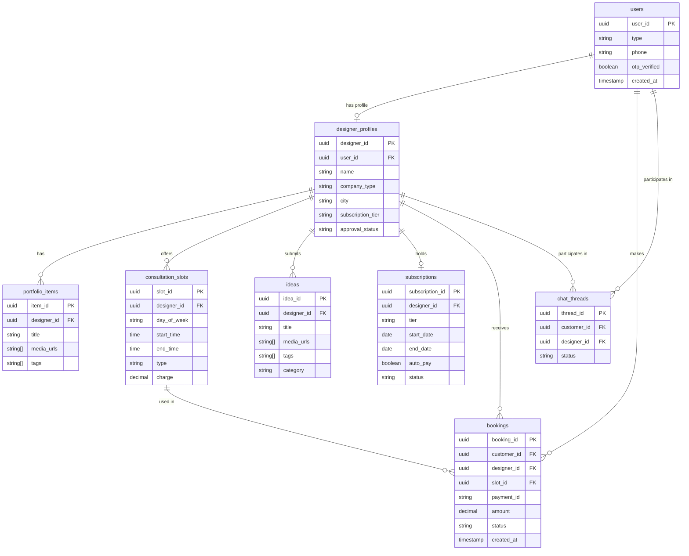
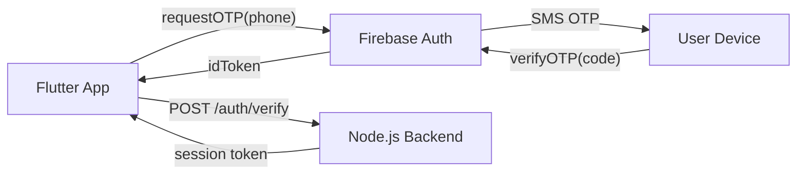
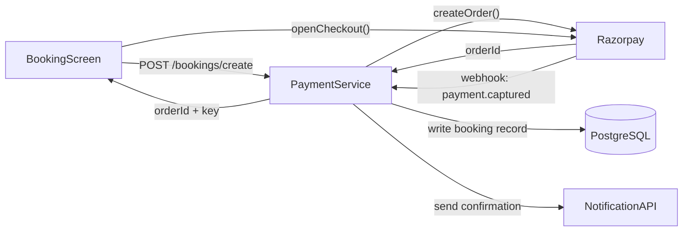
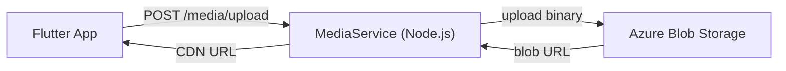
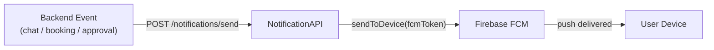

# Developer Handoff — DecorConnect
**Prepared by:** fiftyfive technologies
**Date:** 2026-06-08
**For:** Development team onboarding

---

## Engagement Context
DecorConnect is an internal 55tech product — a two-sided interior design marketplace
mobile app targeting the Indian market, launching first in Jaipur. Homeowners browse
design inspiration, find and hire verified designers, and book paid consultations in-app.
Designers subscribe to be listed on the platform, manage their profiles and portfolios,
and communicate with clients via real-time chat. The admin team approves all designer
applications before they go live. The build runs 40 working days across 4 sprints,
kick-off 2026-06-22, go-live 2026-08-14.

---

## Tech Stack
| Layer | Decision | Status |
|---|---|---|
| Mobile | Flutter (iOS + Android) | ✓ Confirmed |
| Backend | Node.js + Express | ✓ Confirmed |
| Database (core) | PostgreSQL | ✓ Confirmed |
| Database (chat) | Firebase Firestore | ✓ Confirmed |
| Auth | Firebase Auth (Phone/OTP) | ✓ Confirmed |
| Media Storage | Azure Blob Storage | ✓ Confirmed |
| Push Notifications | Firebase FCM | ✓ Confirmed |
| Payment Gateway | Razorpay | ✓ Confirmed |
| Analytics | Firebase Analytics | ✓ Confirmed |
| Infra | Azure App Service | ✓ Confirmed |
| Admin Panel | React (web) | ✓ Confirmed |

---

## Component Inventory

### InspirationScreen
- **Tech:** Flutter
- **Purpose:** Category browse, image slider, room dimension toggle
- **Depends on:** InspirationAPI, MediaService, AuthService (optional)
- **Shared by:** Not shared
- **Open Questions:** None

### InspirationAPI
- **Tech:** Node.js + Express
- **Purpose:** /ideas/categories, /ideas/by-category
- **Depends on:** PostgreSQL
- **Shared by:** Not shared
- **Open Questions:** None

### DesignerProfileScreen
- **Tech:** Flutter
- **Purpose:** Full designer profile — portfolio slider, plans, booking CTA
- **Depends on:** DesignerProfileAPI, MediaService
- **Shared by:** Not shared
- **Open Questions:** None

### DesignerProfileAPI
- **Tech:** Node.js + Express
- **Purpose:** /designers/:id, /designers/:id/portfolio
- **Depends on:** PostgreSQL
- **Shared by:** Not shared
- **Open Questions:** None

### CustomerDashboardScreen
- **Tech:** Flutter
- **Purpose:** Nearby designers, top performers, social proof stats
- **Depends on:** CustomerAPI, LocationService, AuthService
- **Shared by:** Not shared
- **Open Questions:** None

### ExploreScreen
- **Tech:** Flutter
- **Purpose:** Search + filters (city/price/type/budget)
- **Depends on:** CustomerAPI, LocationService
- **Shared by:** Not shared
- **Open Questions:** None

### CompareScreen
- **Tech:** Flutter
- **Purpose:** Side-by-side comparison of 2–3 designers
- **Depends on:** CustomerAPI
- **Shared by:** Not shared
- **Open Questions:** None

### CustomerAPI
- **Tech:** Node.js + Express
- **Purpose:** /designers/nearby, /designers/top, /designers/search, /designers/compare
- **Depends on:** PostgreSQL
- **Shared by:** Not shared
- **Open Questions:** None

### OnboardingFlow
- **Tech:** Flutter
- **Purpose:** 4-step designer sign-up wizard: About → Skills → Experience → Documents
- **Depends on:** DesignerAppAPI, AuthService, MediaService
- **Shared by:** Not shared
- **Open Questions:** None

### DesignerDashboardScreen
- **Tech:** Flutter
- **Purpose:** Profile views/saves analytics for designers
- **Depends on:** DesignerAnalyticsAPI
- **Shared by:** Not shared
- **Open Questions:** None

### ProfileSetupScreen
- **Tech:** Flutter
- **Purpose:** Portfolio management, consultation types, plan setup
- **Depends on:** DesignerAppAPI, MediaService
- **Shared by:** Not shared
- **Open Questions:** None

### SubscriptionScreen
- **Tech:** Flutter
- **Purpose:** Tier management (Free/Basic/Premium), auto-pay, cancel/resume
- **Depends on:** DesignerAppAPI
- **Shared by:** Not shared
- **Open Questions:** None

### SubmitIdeaScreen
- **Tech:** Flutter
- **Purpose:** Idea card creation — images, description, tags
- **Depends on:** DesignerAppAPI, MediaService
- **Shared by:** Not shared
- **Open Questions:** None

### DesignerAppAPI
- **Tech:** Node.js + Express
- **Purpose:** /designer/onboard, /designer/profile, /designer/subscription, /designer/ideas, /designer/analytics
- **Depends on:** PostgreSQL
- **Shared by:** Not shared
- **Open Questions:** None

### ChatScreen
- **Tech:** Flutter
- **Purpose:** Pre-chat screening questions, real-time messaging, attach designs, block/delete
- **Depends on:** ChatService (Firestore), ChatAPI, MediaService
- **Shared by:** Not shared
- **Open Questions:** None

### ChatService
- **Tech:** Firebase Firestore
- **Purpose:** Real-time message sync per chat thread
- **Depends on:** Firebase Firestore
- **Shared by:** Customer App + Designer App
- **Open Questions:** None

### ChatAPI
- **Tech:** Node.js + Express
- **Purpose:** /chat/request, /chat/accept, /chat/block — metadata only
- **Depends on:** PostgreSQL, NotificationAPI
- **Shared by:** Not shared
- **Open Questions:** None

### NotificationService
- **Tech:** Firebase FCM
- **Purpose:** Push notifications for chat, booking, approval triggers
- **Depends on:** Firebase FCM
- **Shared by:** Customer App + Designer App
- **Open Questions:** None

### NotificationAPI
- **Tech:** Node.js + Express
- **Purpose:** /notifications/register-device, /notifications/send
- **Depends on:** Firebase FCM
- **Shared by:** ChatAPI, PaymentService, AdminAPI
- **Open Questions:** None

### BookingScreen
- **Tech:** Flutter
- **Purpose:** Consultation type + slot selection + Razorpay payment initiation
- **Depends on:** PaymentService
- **Shared by:** Not shared
- **Open Questions:** None

### PaymentService
- **Tech:** Node.js + Razorpay SDK
- **Purpose:** Payment order creation, webhook handling, booking record write
- **Depends on:** PostgreSQL, Razorpay, NotificationAPI
- **Shared by:** Not shared
- **Open Questions:** None

### BookingDB
- **Tech:** PostgreSQL (tables: bookings, consultation_slots)
- **Purpose:** Booking records, slot availability, payment status
- **Depends on:** PostgreSQL
- **Shared by:** Not shared
- **Open Questions:** None

### AdminWeb
- **Tech:** React
- **Purpose:** Designer approval queue, platform management dashboard
- **Depends on:** AdminAPI
- **Shared by:** Not shared
- **Open Questions:** None

### AdminAPI
- **Tech:** Node.js + Express
- **Purpose:** /admin/designers/pending, /admin/approve, /admin/reject
- **Depends on:** PostgreSQL, NotificationAPI
- **Shared by:** Not shared
- **Open Questions:** None

### AnalyticsService
- **Tech:** Firebase Analytics (FlutterFire)
- **Purpose:** Event tracking across both mobile apps
- **Depends on:** Firebase Analytics
- **Shared by:** Customer App + Designer App
- **Open Questions:** None

### DesignerAnalyticsAPI
- **Tech:** Node.js + Express
- **Purpose:** /designer/analytics/views-saves
- **Depends on:** PostgreSQL
- **Shared by:** Not shared
- **Open Questions:** None

### AuthService *(shared)*
- **Tech:** Firebase Auth (Phone/OTP)
- **Purpose:** OTP authentication for Customer App + Designer App
- **Depends on:** Firebase Auth
- **Shared by:** Customer App + Designer App
- **Open Questions:** None

### MediaService *(shared)*
- **Tech:** Azure Blob Storage
- **Purpose:** Image/video upload + CDN URL delivery
- **Depends on:** Azure Blob Storage
- **Shared by:** Designer Profiles, Ideas, Chat
- **Open Questions:** None

### LocationService *(shared)*
- **Tech:** Flutter device geolocation
- **Purpose:** Geolocation for nearby designer ranking
- **Depends on:** Device GPS
- **Shared by:** Customer Dashboard + Explore
- **Open Questions:** None

---

## Data Model

*Firebase Firestore:*
`chat_messages/{thread_id}/messages` — sender_id, content, attachments[], timestamp, type (text|design_attachment)

---

## Integration Flows

**Firebase Auth (Phone/OTP)** — Risk: LOW

**Razorpay Payment** — Risk: LOW

**Azure Blob Media Upload** — Risk: LOW

**Firebase FCM Push Notification** — Risk: LOW

---

## Build Order
1. AuthService + PostgreSQL schema + Firebase project setup — foundation for all
2. MediaService (Azure Blob) — needed by profiles, ideas, chat attachments
3. AdminAPI + AdminWeb — approval gate before any designer goes live
4. OnboardingFlow + DesignerAppAPI — supply side before demand side
5. InspirationAPI + InspirationScreen — free-tier value, early launch hook
6. CustomerAPI + LocationService + ExploreScreen + CompareScreen + CustomerDashboardScreen — demand side
7. DesignerProfileScreen + ProfileSetupScreen + SubscriptionScreen — profile + billing
8. ChatService + ChatScreen + ChatAPI + NotificationService — engagement layer
9. BookingScreen + PaymentService + BookingDB — consultation revenue
10. DesignerDashboardScreen + AnalyticsService + SubmitIdeaScreen — analytics + ideas publishing
11. Full QA sweep + UAT + go-live prep

---

## Open Questions

| # | Question | Blocks |
|---|---|---|
| 1 | Azure datacenter region — India South or Central India? | Azure App Service provisioning |
| 2 | Apple Developer + Google Play accounts ready for publishing? | Sprint 4 go-live prep |

---

## STRAWMAN Checklist

Verify all items below before beginning Sprint 1:

- [ ] **Sprint 3 parallel BE + Flutter tracks** — assumes designer onboarding
  completes cleanly by July 17 (end of Sprint 2); if it slips, Sprint 3
  chat + customer tracks compress. Confirm Sprint 2 scope is achievable
  before Sprint 1 ends.
