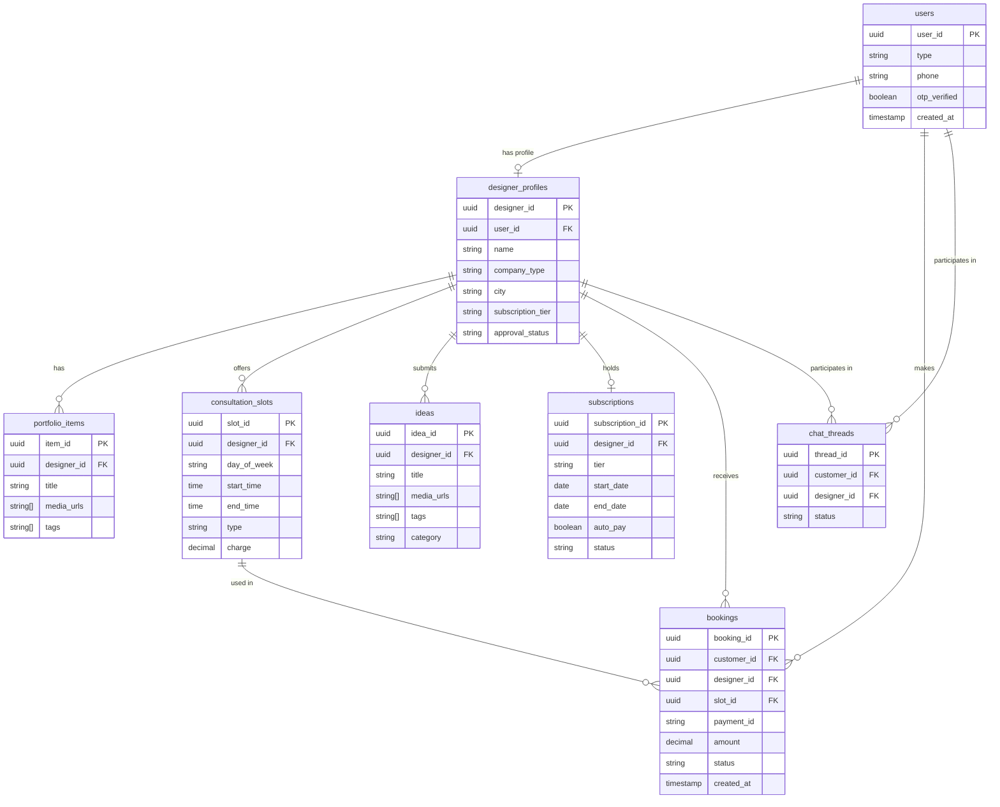
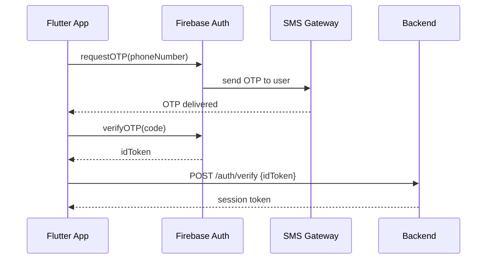
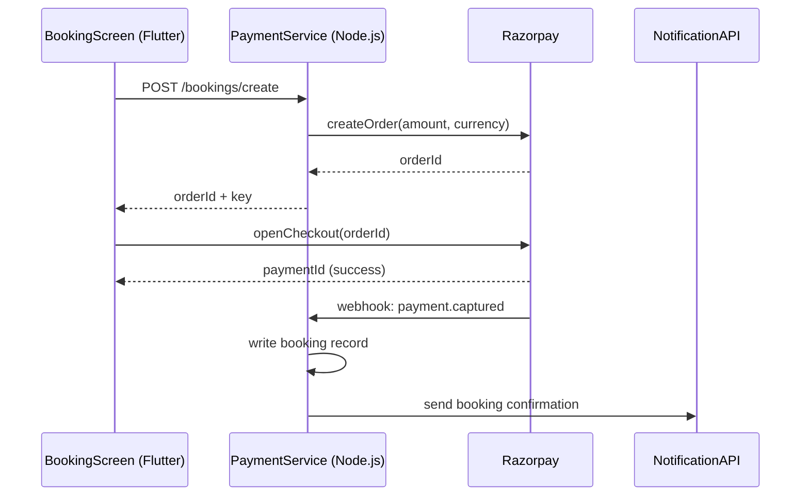
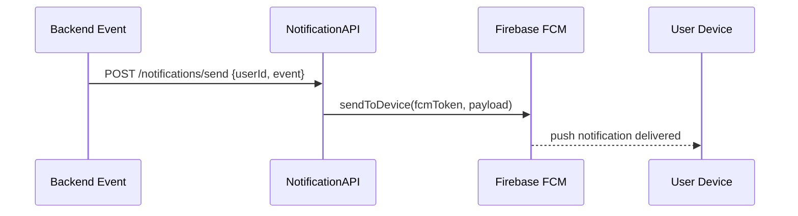

# Technical Architecture — DecorConnect
**Prepared by:** fiftyfive technologies
**Date:** 2026-06-08
**Source:** arch.md (V1.3 — ARCH_PROPOSER output)

---

## Overview
DecorConnect is a two-sided interior design marketplace mobile app connecting
homeowners in Jaipur with verified interior designers. The platform supports two
separate mobile apps (customer-facing and designer-facing), a web-based admin panel,
and a shared backend API layer — all backed by a hybrid data store combining
PostgreSQL for core relational data and Firebase Firestore for real-time chat.

---

## Tech Stack
| Layer | Decision | Status |
|---|---|---|
| Mobile | Flutter (iOS + Android) | ✓ Confirmed |
| Backend | Node.js + Express | ✓ Confirmed |
| Database (core) | PostgreSQL | ✓ Confirmed |
| Database (chat) | Firebase Firestore | ✓ Confirmed |
| Auth | Firebase Auth (Phone/OTP) | ✓ Confirmed |
| Media Storage | Azure Blob Storage | ✓ Confirmed |
| Push Notifications | Firebase FCM | ✓ Confirmed |
| Payment Gateway | Razorpay | ✓ Confirmed |
| Analytics | Firebase Analytics | ✓ Confirmed |
| Infra | Azure App Service | ✓ Confirmed |
| Admin Panel | React (web) | ✓ Confirmed |

---

## Architecture Diagram

```mermaid
graph TD
    subgraph "Customer App (Flutter)"
        CA[CustomerDashboardScreen]
        EX[ExploreScreen]
        CO[CompareScreen]
        IS[InspirationScreen]
        BS[BookingScreen]
        CS[ChatScreen]
    end
    subgraph "Designer App (Flutter)"
        OB[OnboardingFlow]
        PS[ProfileSetupScreen]
        SS[SubscriptionScreen]
        SI[SubmitIdeaScreen]
        DD[DesignerDashboardScreen]
    end
    subgraph "Admin Panel (React)"
        AW[AdminWeb]
    end
    subgraph "Backend (Node.js + Express)"
        CAPI[CustomerAPI]
        DAPI[DesignerAppAPI]
        IAPI[InspirationAPI]
        CHAT[ChatAPI]
        PAY[PaymentService]
        NOTIF[NotificationAPI]
        ADMIN[AdminAPI]
        DANALYTIC[DesignerAnalyticsAPI]
    end
    subgraph "Shared"
        AUTH[AuthService - Firebase Auth]
        MEDIA[MediaService - Azure Blob]
        LOC[LocationService]
    end
    subgraph "Data"
        PG[(PostgreSQL)]
        FSTORE[(Firebase Firestore)]
        FCM[Firebase FCM]
        RAZ[Razorpay]
        FA[Firebase Analytics]
    end

    CA & EX & CO --> CAPI
    IS --> IAPI
    BS --> PAY
    CS --> CHAT
    CS --> FSTORE
    OB & PS & SS & SI & DD --> DAPI
    AW --> ADMIN
    CAPI & DAPI & IAPI & CHAT & PAY & ADMIN & DANALYTIC --> PG
    NOTIF --> FCM
    CHAT --> NOTIF
    PAY --> RAZ
    PAY & ADMIN --> NOTIF
    CA & EX --> LOC
    IS & PS & SI & CS --> MEDIA
    CA & OB --> AUTH
    CA & OB --> FA
```

---

## Component Inventory

### InspirationScreen
- **Tech:** Flutter
- **Purpose:** Category browse, image slider, room dimension toggle
- **Dependencies:** InspirationAPI, MediaService, AuthService (optional)
- **Shared:** No

### InspirationAPI
- **Tech:** Node.js + Express
- **Purpose:** /ideas/categories, /ideas/by-category
- **Dependencies:** PostgreSQL
- **Shared:** No

### DesignerProfileScreen
- **Tech:** Flutter
- **Purpose:** Full designer profile — portfolio slider, plans, booking CTA
- **Dependencies:** DesignerProfileAPI, MediaService
- **Shared:** No

### DesignerProfileAPI
- **Tech:** Node.js + Express
- **Purpose:** /designers/:id, /designers/:id/portfolio
- **Dependencies:** PostgreSQL
- **Shared:** No

### CustomerDashboardScreen
- **Tech:** Flutter
- **Purpose:** Nearby designers, top performers, social proof stats
- **Dependencies:** CustomerAPI, LocationService, AuthService
- **Shared:** No

### ExploreScreen
- **Tech:** Flutter
- **Purpose:** Search + filters (city/price/type/budget)
- **Dependencies:** CustomerAPI, LocationService
- **Shared:** No

### CompareScreen
- **Tech:** Flutter
- **Purpose:** Side-by-side comparison of 2–3 designers
- **Dependencies:** CustomerAPI
- **Shared:** No

### CustomerAPI
- **Tech:** Node.js + Express
- **Purpose:** /designers/nearby, /designers/top, /designers/search, /designers/compare
- **Dependencies:** PostgreSQL
- **Shared:** No

### OnboardingFlow
- **Tech:** Flutter
- **Purpose:** 4-step designer sign-up wizard: About → Skills → Experience → Documents
- **Dependencies:** DesignerAppAPI, AuthService, MediaService
- **Shared:** No

### DesignerDashboardScreen
- **Tech:** Flutter
- **Purpose:** Profile views/saves analytics for designers
- **Dependencies:** DesignerAnalyticsAPI
- **Shared:** No

### ProfileSetupScreen
- **Tech:** Flutter
- **Purpose:** Portfolio management, consultation types, plan setup
- **Dependencies:** DesignerAppAPI, MediaService
- **Shared:** No

### SubscriptionScreen
- **Tech:** Flutter
- **Purpose:** Tier management (Free/Basic/Premium), auto-pay, cancel/resume
- **Dependencies:** DesignerAppAPI
- **Shared:** No

### SubmitIdeaScreen
- **Tech:** Flutter
- **Purpose:** Idea card creation — images, description, tags
- **Dependencies:** DesignerAppAPI, MediaService
- **Shared:** No

### DesignerAppAPI
- **Tech:** Node.js + Express
- **Purpose:** /designer/onboard, /designer/profile, /designer/subscription, /designer/ideas, /designer/analytics
- **Dependencies:** PostgreSQL
- **Shared:** No

### ChatScreen
- **Tech:** Flutter
- **Purpose:** Pre-chat screening questions, real-time messaging, attach designs, block/delete
- **Dependencies:** ChatService (Firestore), ChatAPI, MediaService
- **Shared:** No

### ChatService
- **Tech:** Firebase Firestore
- **Purpose:** Real-time message sync per chat thread
- **Dependencies:** Firebase Firestore
- **Shared:** Yes — used by Customer App + Designer App

### ChatAPI
- **Tech:** Node.js + Express
- **Purpose:** /chat/request, /chat/accept, /chat/block — metadata management only
- **Dependencies:** PostgreSQL, NotificationAPI
- **Shared:** No

### NotificationService
- **Tech:** Firebase FCM
- **Purpose:** Delivers push notifications for chat, booking, and approval triggers
- **Dependencies:** Firebase FCM
- **Shared:** Yes — used by Customer App + Designer App

### NotificationAPI
- **Tech:** Node.js + Express
- **Purpose:** /notifications/register-device, /notifications/send
- **Dependencies:** Firebase FCM
- **Shared:** Yes — called by ChatAPI, PaymentService, AdminAPI

### BookingScreen
- **Tech:** Flutter
- **Purpose:** Consultation type + slot selection + Razorpay payment initiation
- **Dependencies:** PaymentService
- **Shared:** No

### PaymentService
- **Tech:** Node.js + Razorpay SDK
- **Purpose:** Payment order creation, webhook handling, booking record write
- **Dependencies:** PostgreSQL, Razorpay, NotificationAPI
- **Shared:** No

### BookingDB
- **Tech:** PostgreSQL (tables: bookings, consultation_slots)
- **Purpose:** Stores booking records, slot availability, payment status
- **Dependencies:** PostgreSQL
- **Shared:** No

### AdminWeb
- **Tech:** React
- **Purpose:** Designer approval queue, platform management dashboard
- **Dependencies:** AdminAPI
- **Shared:** No

### AdminAPI
- **Tech:** Node.js + Express
- **Purpose:** /admin/designers/pending, /admin/approve, /admin/reject
- **Dependencies:** PostgreSQL, NotificationAPI
- **Shared:** No

### AnalyticsService
- **Tech:** Firebase Analytics (FlutterFire plugin)
- **Purpose:** Event tracking across Customer App + Designer App
- **Dependencies:** Firebase Analytics
- **Shared:** Yes — used by both mobile apps

### DesignerAnalyticsAPI
- **Tech:** Node.js + Express
- **Purpose:** /designer/analytics/views-saves
- **Dependencies:** PostgreSQL
- **Shared:** No

### AuthService *(shared)*
- **Tech:** Firebase Auth (Phone/OTP)
- **Purpose:** OTP-based authentication for Customer App + Designer App
- **Dependencies:** Firebase Auth
- **Shared:** Yes — used by Customer App + Designer App

### MediaService *(shared)*
- **Tech:** Azure Blob Storage
- **Purpose:** Image/video upload endpoint + CDN URL delivery
- **Dependencies:** Azure Blob Storage
- **Shared:** Yes — used by Designer Profiles, Ideas, Chat

### LocationService *(shared)*
- **Tech:** Flutter device geolocation
- **Purpose:** Geolocation for nearby designer ranking
- **Dependencies:** Device GPS
- **Shared:** Yes — used by Customer Dashboard + Explore

---

## Data Model

*Firebase Firestore (chat):*
`chat_messages/{thread_id}/messages` — sender_id, content, attachments[], timestamp, type (text|design_attachment)

---

## Integration Points
| System | Approach | Risk | Open Questions |
|---|---|---|---|
| Firebase Auth (Phone) | OTP via Firebase Auth SDK | LOW | None |
| Razorpay | Flutter SDK + Node.js webhook | LOW | None |
| Firebase Firestore | FlutterFire plugin, real-time chat | LOW | None |
| Firebase FCM | FlutterFire plugin, server triggers | LOW | None |
| Azure Blob Storage | Node.js upload endpoint + CDN URLs | LOW | None |
| Firebase Analytics | FlutterFire plugin, event tracking | LOW | None |

**OTP Authentication Flow**

**Razorpay Payment Flow**

**Push Notification Flow**

---

## Build Order
1. AuthService + PostgreSQL schema + Firebase project setup — foundation for all
2. MediaService (Azure Blob) — needed by profiles, ideas, chat attachments
3. AdminAPI + AdminWeb — designer approval gate before any designer goes live
4. OnboardingFlow + DesignerAppAPI — supply side before demand side
5. InspirationAPI + InspirationScreen — free-tier value, early launch hook
6. CustomerAPI + LocationService + ExploreScreen + CompareScreen + CustomerDashboardScreen — demand side
7. DesignerProfileScreen + ProfileSetupScreen + SubscriptionScreen — profile + billing
8. ChatService + ChatScreen + ChatAPI + NotificationService — engagement layer
9. BookingScreen + PaymentService + BookingDB — consultation revenue
10. DesignerDashboardScreen + AnalyticsService + SubmitIdeaScreen — analytics + ideas publishing
11. Full QA sweep + UAT + go-live prep

---

## Open Questions
1. Azure datacenter region not confirmed — India South or Central India?
   Blocks: Azure App Service provisioning
2. Apple Developer + Google Play accounts — ready for publishing?
   Blocks: Sprint 4 go-live prep

---

## STRAWMAN Summary
All tentative decisions — verify before Sprint 1:
- [STRAWMAN] Sprint 3 parallel BE + Flutter tracks — assumes designer onboarding
  completes cleanly by Day 20; if it slips, Sprint 3 chat + customer tracks compress
