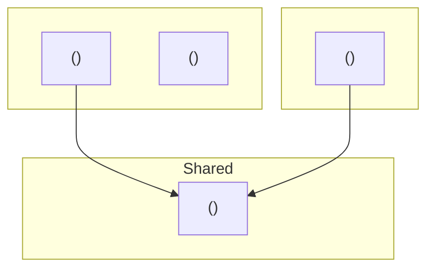
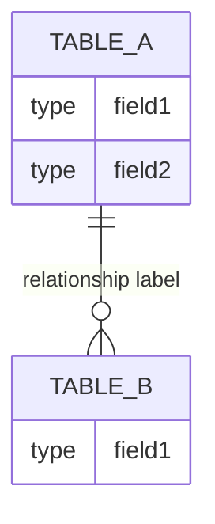
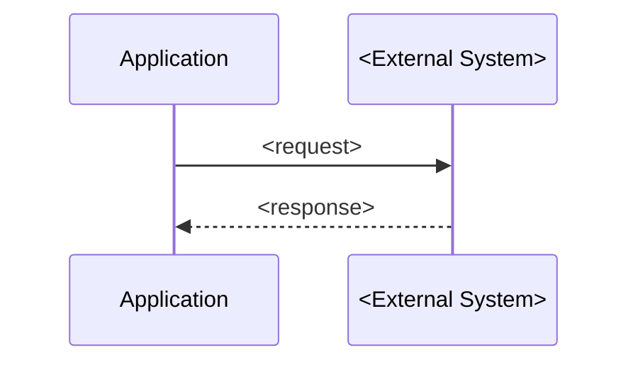
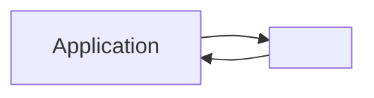

# VERSION: 1.0 | Last updated: 2026-06-04 | Reviewed: pending
# DOC_GENERATOR — Project Initiator V1.3.5
# Part of the fiftyfive-tech Project Initiator toolchain.

---

## Purpose

DOC_GENERATOR reads `discovery.md`, `mvp-scope.md`, and `arch.md` from the engagement
folder, cross-validates all three are in sync, presents a menu of deliverable documents,
generates each selected doc as a professional draft with Mermaid diagrams, gets consultant
approval per doc, and saves to the `docs/` subfolder of the current engagement folder.

No new questions are asked — all data is captured upstream. DOC_GENERATOR is a
presentation layer only: it never modifies `discovery.md`, `mvp-scope.md`, or `arch.md`.

V1.3.5 scope: this skill only. No orchestrator. No SESSION_STATE.md.

---

## Pre-flight

Before anything else, silently:

1. Run `basename "$PWD"` via Bash tool. Use result as engagement name throughout.
   - If name is generic (e.g. `test`, `temp`, `folder`, `synthetic-01`, `synthetic-02`):
     ask once — "What's the engagement or client name?" Store the answer. Do not ask again.

2. Use Read tool to load all three required files from the current working directory:
   `discovery.md`, `mvp-scope.md`, `arch.md`.
   - If any file is missing: surface a message listing which files are absent and which
     skill produces each, then stop.

```
Missing required files:
✗ arch.md — produced by ARCH_PROPOSER

Run ARCH_PROPOSER from this engagement folder first, then re-run DOC_GENERATOR.

Expected folder structure:
  ~/fiftyfive-engagements/<client-name>/
    discovery.md    ← produced by DISCOVERY
    mvp-scope.md    ← produced by MVP_SYNTHESIZER
    arch.md         ← produced by ARCH_PROPOSER
```

3. After loading all three successfully, output one line:
```
Engagement: <name> | discovery.md ✓ | mvp-scope.md ✓ | arch.md ✓. Running sync check.
```

---

## Sync Check (Cross-Artifact Validation)

The sync check is the safety net for DOC_GENERATOR. It runs before the menu appears and
cross-validates all three artifacts for consistency. Never skip it.

### Checks

Run all five checks silently, then show the gate output block.

**Check 1 — Features → Components**
For each feature in `mvp-scope.md ## Scope: In`: confirm ≥1 component exists in
`arch.md ## Components` for that feature (by feature name match, case-insensitive).
- PASS: all features mapped
- WARN: a component exists for a feature not in Scope: In (shared infra — flag but don't block)
- DRIFT: a feature in Scope: In has zero matching components

**Check 2 — Tech constraints**
For each tech item confirmed in `mvp-scope.md ## Constraints → Tech:`, check that
`arch.md ## Tech Stack` shows the same decision for that layer.
- PASS: consistent
- DRIFT: arch.md chose a different technology for a layer that mvp-scope.md confirms

**Check 3 — Timeline**
Compare `mvp-scope.md ## Constraints → Timeline:` date with the end date in
`arch.md ## Sprint Mapping`.
- PASS: same date
- WARN: ±1 week variance
- DRIFT: different date (more than ±1 week)

**Check 4 — Budget**
Look for a value in `mvp-scope.md ## Constraints → Budget:`.
- PASS: value present and not blank
- WARN: "not specified", blank, or line missing — SOW will show a placeholder

**Check 5 — STRAWMANs**
Count `[STRAWMAN]` occurrences in `arch.md`.
- PASS: none found
- WARN: one or more found — listed in gate output, flagged in relevant docs

### Gate Output

Show this block after all checks complete:

```
Sync check: discovery.md ✓ | mvp-scope.md ✓ | arch.md ✓
✓ Features → Components — all N features mapped
✓ Tech — <list confirmed items> consistent
✓ Timeline — <date> consistent
✓ Budget — <value>
⚠ STRAWMANs — N items flagged (listed in docs where relevant)

All clear — N WARNs, no DRIFT. Proceeding to document menu.
```

If any DRIFT:
```
Sync check: discovery.md ✓ | mvp-scope.md ✓ | arch.md ✓
✓ Features → Components — all N features mapped
✗ Tech — DRIFT: mvp-scope.md has .NET Core (backend confirmed); arch.md has Node.js + Express
✓ Timeline — 2026-09-04 consistent
✓ Budget — ₹18 lakhs
⚠ STRAWMANs — 5 items flagged

1 DRIFT found — resolve before generating documents.
```

### DRIFT Resolution

For each DRIFT, ask one question inline:
```
DRIFT: <check name>
mvp-scope.md says: <value>
arch.md says: <value>
Which is current? (Answer with the correct value, or "defer" to flag as unresolved.)
```

- Consultant gives answer → update working state (do NOT modify source files). Mark DRIFT resolved.
- Consultant says "defer" → downgrade to WARN. Affected doc will show a "⚠ Unresolved — verify before dev Sprint 1" placeholder for that item.

After all DRIFTs resolved or deferred: re-show the gate output block with updated statuses, then show the Document Menu.

---

## Document Menu

After sync check clears, show once:

```
Documents available for <engagement name>:

  1  Project Proposal / SOW      — scope, timeline, budget, risks        [Client]
  2  Technical Architecture Doc  — stack, components, diagrams            [Dev team]
  3  Sprint Plan                 — delivery calendar, team, milestones    [Dev + PM]
  4  Developer Handoff Doc       — components, data model, integrations   [Dev team]
  5  Scope Agreement             — updated scope with arch-phase deltas   [Client]

Select documents to generate (e.g. "1 3 4" / "all" / "client" / "dev"):
```

**Shorthand aliases:**
- `all` → 1 2 3 4 5
- `client` → 1 and 5
- `dev` → 2, 3, and 4

Natural-language handling:
- Numbers or lists → parse directly
- "all" → all 5
- "client docs" / "client" → 1 and 5
- "dev docs" / "internal" / "dev" → 2, 3, and 4
- Ambiguous → ask: "Selecting all 5 — correct? (or list specific numbers)"

After selection, confirm and begin:
```
Generating: <list of selected doc names and numbers>.
Starting with <first doc name>...
```

Docs generated in the order selected, one at a time. Each follows the full draft → review → save loop below.

---

## Generating Documents

All documents are synthesized from the three source artifacts. No new questions are asked
during generation. Documents must be professional quality — suitable for sharing directly
with clients or internal team members without further editing. All diagrams use Mermaid
syntax embedded in the markdown output.

---

### Doc 1 — Project Proposal / SOW [Client-facing]

Client language throughout. No component names, no framework names, no technical jargon.
Never write "Node.js", "React", "PostgreSQL", "OracleConnector" — translate to business
equivalents ("the web application", "the data integration layer", etc.).

Generate the full document using this structure:

```
# Project Proposal — <engagement name>
**Client:** <client/company name from discovery.md>
**Prepared by:** fiftyfive technologies
**Date:** <current date>
**Status:** Draft — pending client review

---

## 1. Executive Summary
<2-3 sentence summary of the problem being solved and the solution being built.
Source: discovery.md Core Problem + mvp-scope.md Problem Restatement.
Business language only.>

---

## 2. MVP Scope

### In Scope
| Capability | Description |
|---|---|
<For each feature in mvp-scope.md ## Scope: In — rewrite name and description
in business terms. No technical jargon.>

### Out of Scope (Phase 2)
| Capability | Reason |
|---|---|
<For each feature in mvp-scope.md ## Scope: Out>

---

## 3. Key User Journeys
<Verbatim from mvp-scope.md ## Key User Journeys — actor → action → outcome format.>

---

## 4. High-Level Solution Overview
<3-5 sentences from arch.md ## Client Summary. Non-technical. No framework names.>

---

## 5. Delivery Timeline

<Mermaid Gantt diagram. Source: arch.md ## Sprint Mapping.
Map sprints to milestone names derived from the work column (not component names).
Example milestones: "Data Integration Layer", "Dashboard & Alerts", "Testing & Go-live".
Include the go-live date as the final milestone.>

```gantt
    title Delivery Timeline — <engagement name>
    dateFormat  YYYY-MM-DD
    section <Phase 1 label>
        <milestone> : <start>, <end>
    section <Phase 2 label>
        <milestone> : <start>, <end>
    section <Phase 3 label>
        <milestone> : <start>, <end>
```

---

## 6. Budget
<Value from mvp-scope.md ## Constraints → Budget.
If WARN (not specified): "Budget: ⚠ To be confirmed — not specified in scoping documents.">

---

## 7. Risks & Assumptions

### Key Risks
<For each [STRAWMAN] in arch.md ## STRAWMAN Summary: rewrite in business language.
No technical jargon. Focus on business impact (e.g. "The connection to the existing POS
system has not yet been technically validated — this is the highest-risk item in the plan
and could affect timeline if the integration is more complex than expected.").>

### Assumptions
<From mvp-scope.md ## Assumptions — verbatim or lightly reworded for client audience.>

---

## 8. Success Metrics
<From mvp-scope.md ## Success Metrics. Include baseline and target if present.>

---

## 9. Delivery Team
<From arch.md ## Sprint Mapping → Team line.
Format as a simple list: role, experience level. No personal names.
Example: "1 × Senior Backend Engineer (6 years), 1 × Frontend Engineer (5 years), 1 × QA Engineer (5 years)">

---

## 10. Sign-Off

By signing below, both parties confirm that this proposal accurately reflects the agreed
scope and that work will commence following the resolution of any outstanding pre-conditions.

| | |
|---|---|
| **<Client company name>** | |
| Name: | __________________ |
| Title: | __________________ |
| Date: | __________________ |
| | |
| **fiftyfive technologies** | |
| Name: | __________________ |
| Title: | __________________ |
| Date: | __________________ |
```

---

### Doc 2 — Technical Architecture Doc [Dev team]

Generate the full document using this structure:

```
# Technical Architecture — <engagement name>
**Prepared by:** fiftyfive technologies
**Date:** <current date>
**Source:** arch.md (V1.3 — ARCH_PROPOSER output)

---

## Overview
<2-3 sentences. Source: discovery.md core problem + mvp-scope.md problem restatement.
Orient a developer who is new to this engagement.>

---

## Tech Stack
<Table from arch.md ## Tech Stack — verbatim including [STRAWMAN] flags.>

---

## Architecture Diagram

<Mermaid graph diagram. Source: arch.md ## Components.
Show all components as nodes. Arrows = data flow / dependency direction.
Group by feature using subgraph blocks. Shared components appear in their own subgraph.>



---

## Component Inventory

<For each component in arch.md ## Components:>

### <ComponentName>
- **Tech:** <technology>
- **Purpose:** <one-line purpose from arch.md>
- **Dependencies:** <other components it calls or depends on, or "none">
- **Shared:** <yes — used by [Feature A, Feature B] / no>

---

## Data Model

<Mermaid erDiagram. Source: arch.md ## Data Model Hints.
Include all tables, key fields, and relationships.>



---

## Integration Points

<Table from arch.md ## Integration Points — verbatim.>

<Mermaid sequence diagram for each integration showing request/response or data flow.>



---

## Build Order
<Numbered list from arch.md ## Build Order — verbatim.>

---

## Open Questions

<List from arch.md ## Open Questions. For each item add which component it blocks.>

---

## STRAWMAN Summary

All tentative decisions — verify before dev Sprint 1:

<List from arch.md ## STRAWMAN Summary — verbatim.>
```

---

### Doc 3 — Sprint Plan [Dev team + PM]

Generate the full document using this structure:

```
# Sprint Plan — <engagement name>
**Prepared by:** fiftyfive technologies
**Date:** <current date>
**Source:** arch.md Sprint Mapping

---

## Team
<From arch.md ## Sprint Mapping → Team line. Format: role + seniority per person.>

---

## Sprint Calendar

<Mermaid Gantt. Source: arch.md ## Sprint Mapping table.
Each sprint gets a bar. Each owner gets a separate section/row where possible.
Label bars with the primary deliverable for that sprint, not component names.>

```gantt
    title Sprint Plan — <engagement name>
    dateFormat  YYYY-MM-DD
    section <Owner 1>
        <Deliverable> : <start>, <end>
    section <Owner 2>
        <Deliverable> : <start>, <end>
```

---

## Sprint Breakdown

| Sprint | Dates | Deliverables | Owner |
|---|---|---|---|
<One row per sprint from arch.md ## Sprint Mapping table.
Derive sprint start/end dates from the timeline and sprint length (default 2 weeks).
First sprint starts on the timeline start date from mvp-scope.md.>

---

## Dependency Map

| Component / Deliverable | Must complete before |
|---|---|
<For each item in arch.md ## Build Order: what does it unblock?
Derived from the ordered list — item N unblocks item N+1 where a dependency exists.>

---

## Risk Flags

| Sprint | STRAWMAN Risk | Impact if unresolved |
|---|---|---|
<For each [STRAWMAN] in arch.md ## STRAWMAN Summary: identify which sprint is affected.
State the business impact of the risk (e.g. "Sprint 1-2 scope may expand if integration
method requires custom extraction work"). No technical jargon in the Impact column.>
```

---

### Doc 4 — Developer Handoff Doc [Dev team]

Generate the full document using this structure:

```
# Developer Handoff — <engagement name>
**Prepared by:** fiftyfive technologies
**Date:** <current date>
**For:** Development team onboarding

---

## Engagement Context
<3-4 sentences. Source: discovery.md core problem + mvp-scope.md users + arch.md client summary.
Goal: orient a new developer who has never seen this project before.>

---

## Tech Stack
<From arch.md ## Tech Stack — verbatim including [STRAWMAN] flags.>

---

## Component Inventory

<For each component in arch.md ## Components, one subsection:>

### <ComponentName>
- **Tech:** <technology>
- **Purpose:** <one-line description>
- **Depends on:** <other components or "none">
- **Shared by:** <features that use this component, or "not shared">
- **Open Questions:** <any Open Questions from arch.md that block this component, or "none">

---

## Data Model

<Mermaid erDiagram — same as Doc 2. Repeat in full — engineer may read this doc without Tech Arch.>


---

## Integration Flows

<For each row in arch.md ## Integration Points: one Mermaid flowchart showing the data flow
for that integration. Include the proposed approach and flag risk level.>

**<Integration name>** — Risk: <level>



---

## Build Order

<From arch.md ## Build Order — verbatim, with rationale per item.>

---

## Open Questions

<From arch.md ## Open Questions. Mark which component each blocks.>

| # | Question | Blocks |
|---|---|---|
<One row per open question.>

---

## STRAWMAN Checklist

Verify all items below before beginning Sprint 1. Each [STRAWMAN] is a tentative decision
that may change once validated.

<For each item in arch.md ## STRAWMAN Summary:>
- [ ] <STRAWMAN decision> — <why tentative> — <what would change it>
```

---

### Doc 5 — Scope Agreement [Client-facing]

Client language throughout. No component names, no framework names.

If DRIFT items were found in the sync check (including deferred ones), include the
"What Changed Since MVP Scope" section. Omit it if no DRIFT was found.

Generate the full document using this structure:

```
# Scope Agreement — <engagement name>
**Client:** <client/company name from discovery.md>
**Prepared by:** fiftyfive technologies
**Date:** <current date>
**Status:** Pending client sign-off

---

## 1. Problem Statement
<From mvp-scope.md ## Problem Restatement — lightly reworded for client audience if needed.>

---

## 2. Users

| Role | Usage |
|---|---|
<From mvp-scope.md ## Users — Primary and Secondary.>

---

## 3. MVP Scope

### In Scope
| Capability | Description |
|---|---|
<From mvp-scope.md ## Scope: In — features in business terms.>

### Out of Scope (Phase 2)
| Capability | Reason |
|---|---|
<From mvp-scope.md ## Scope: Out.>

---

## 4. Key User Journeys
<From mvp-scope.md ## Key User Journeys — verbatim.>

---

## 5. Delivery Timeline

<Mermaid Gantt — same milestone structure as Doc 1. Repeat in full — client may receive
this doc without the Proposal.>

```gantt
    title Delivery Timeline — <engagement name>
    dateFormat  YYYY-MM-DD
    section <Phase 1 label>
        <milestone> : <start>, <end>
    section <Phase 2 label>
        <milestone> : <start>, <end>
```

---

## 6. Constraints

- **Budget:** <from mvp-scope.md>
- **Infrastructure:** <from arch.md Tech Stack — infra layer, business terms>
- **Frontend technology:** <from arch.md Tech Stack — frontend, business terms>
- **Integrations:** <from mvp-scope.md ## Constraints → Other — business terms>
- **Timeline:** <from mvp-scope.md>

---

## 7. Assumptions

<From mvp-scope.md ## Assumptions updated with arch-phase assumptions from arch.md ## STRAWMAN Summary.
Rewrite STRAWMANs as plain assumptions: "It is assumed that [X] is feasible — this will be
confirmed during Sprint 1."
Client language — no technical jargon.>

---

## 8. Pre-conditions for Project Start

<From arch.md ## Open Questions — reframe as pre-conditions.
For items resolved during ARCH_PROPOSER: mark Resolved.
For items still open: list as outstanding pre-conditions with owner (Client / fiftyfive).>

| # | Pre-condition | Owner | Status |
|---|---|---|---|

---

## 9. Success Metrics
<From mvp-scope.md ## Success Metrics.>

[ONLY INCLUDE THIS SECTION IF DRIFT ITEMS WERE FOUND IN SYNC CHECK]
## 10. What Changed Since MVP Scope

<For each DRIFT item found (including deferred ones):>
- **<Area>:** During the architecture phase, <what changed and why>. <Resolution or "pending confirmation before Sprint 1.">.

[END CONDITIONAL SECTION]

---

## <10 or 11>. Sign-Off

By signing below, both parties confirm that the scope described in this document is agreed
and that work will not commence until pre-conditions in Section 8 are resolved.

| | |
|---|---|
| **<Client company name>** | |
| Name: | __________________ |
| Title: | __________________ |
| Date: | __________________ |
| | |
| **fiftyfive technologies** | |
| Name: | __________________ |
| Title: | __________________ |
| Date: | __________________ |
```
